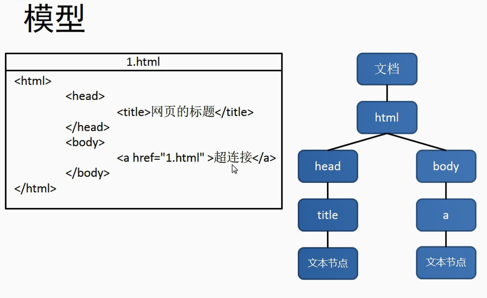

### JS-DOM

#### 什么是 DOM

    DOM- Document Object Model 文档对象模型
    
    Js 通过 DOM 对 HTML 文档进行操作，只要理解 DOM 就可以为心所欲的对 web 页面进行操作
    
    Document 
    
        文档表示的是整个 html 页面的文档
    
    Object
    
        对象表示的是将网页每一个部分都转换为一个对象
    
    Model

        使用模型来表示对象间的关系，这样方便我们获取对象

#### Node (节点)

Node 简介

    Node 构成 html 文档最基本的单元

    常用节点分为四类

        1. 文档节点
            整个 html 文档
        2. 元素节点
            html 文档中的 html 标签
        3. 属性节点
            元素属性
        4. 文本节点
            html 文档中的文本内容

Node property

#### 事件

    事件就是用户和浏览器之间的交互行为,比如:点击按钮,鼠标移动...

    我们可以在事件对应的属性中添加一些 js 代码，这样事件触发时，这些代码就会被执行。当然这种写法就是结构和行为的耦合，不方便维护，不推荐使用。

    可以为对应的事件绑定处理函数的形式来响应事件，这样事件触发时，其对应的函数就会被调用

#### 文档的加载

    浏览器再加载一个页面时，是按照从上到下的顺序，读取一行就运行一行

    如果将 script 标签写在上面，页面还没有加载完的时候，代码已经运行了

    针对这样的案列，可以设置 onlode 语法

+ ###### onload 事件

    事件会在整个页面加载完之后才触发

    为 window 绑定一个 onload 事件
    
    `window.onload = function(){
        alert("hello");
    }`
    
    该事件对用的响应函数会在页面加载完之后执行

#### 获取元素节点

##### 通过 Document 对象调用

1. getElementById()
    通过 id 属性获取**一个**元素节点对象
2. getElementsByTagName()
    通过 标签名 获取**一组**元素节点对象
    这个方法会给我们返回一个类数组对象，所有查询得到的元素都会封装到对象中
    即使查询到的元素只有一个，也会封装到数组中返回
3. getElementsByName()
    通过 name 属性获取**一组**元素节点对象

注： innnerHTML 用于获取元素内部的 HTML 代码，对于自结束标签，这个属性没有意义
    如果要读取元素节点属性，直接使用`元素.属性名`
    例子：
        `元素.id，元素.name，元素.name`
        但是 class 属性本采用这种形式
        读取 class 属性时用`元素.className`

#### 获取元素节点的子节点

##### 通过具体的元素节点调用

1. **getElementsByTagName()**

    **方法**，返回当前节点的制定标签名后代节点

2. **childNodes**

    **属性**，表示当前节点的所有子节点

    childNode 属性会获取包括文本在内的所有节点，包括 DOM 标签间的空白也会当成文本节点

    在 iE8 以下的浏览器中，不会把空白部分当成文本字节

3. **firstChild**

    **属性**，表示当前节点的第一个子节点（包括空白节点）

4. **lastChild**

    **属性**，表示当前节点的最后一个子节点

5. **children**
    
    **属性**，可以获取当前元素的所有**子元素**

#### 获取父节点和兄弟节点

##### 通过具体的节点调用

1. ######  parentNode

    **属性**，表示当前节点的父节点
2. ###### previousSibling
    **属性**，表示当前节点的前一个兄弟节点（包括空白文本）
3. ###### nextSibling
    **属性**，表示当前节点的后面一个兄弟节点
4. ###### innerText
    **属性**，可以获取元素内部的文本内容
    它和 innerHtml 属性类似，不同的是它会自动将 html 去除
#### 获取其他标签

1. body 标签

    获取 body 标签语法：直接是

    `var body = document.body`
    
2. document.documentElement

    保存的是 html 根标签
3. document.all

    表示的是页面上所有的标签

4. class

    根据元素的 class 属性查询一组元素节点

    **getElementsByClassName**()可以根据 class 属性获取一组元素节点对象，但是该方法不支持 ie8 以下的浏览器

5. document.querySelector()

    需要一个选择器字符串作为参数，可以根据一个 css 选择器来查询一个元素的节点对象

    ie8 浏览器中不能使用 getElementByClassName() 属性，但是可以使用 document.querySelector() 属性

    使用给方法只会返回唯一的一个元素，如果满足条件的元素有多个，那么他只会返回第一个

6. document.querySelectorAll()

    该方法和 document.querySelector() 类似，不同的是，它会将符合条件的结果封装到一个数组中返回

    即使是符合条件的元素有一个，也会返回数组

---
> 在事件响应函数中，响应函数是给谁绑定的，this 就是谁
> 因为该事件是以方法的形式调用的，以方法的形式调用就是 this
> 如果是函数的形式调用调用对象就是 window
---

#### 增加 DOM

##### 创建一个元素节点对象

###### document.creatElement()

    用来创建一个元素节点对象
    需要一个标签名作为参数，将会根据标签名创建元素节点对象
    并将创建好的对象作为返回值返回

###### document.creatText()

    creatTextNode(date:String):String Document
     创建一个文本节点对象，需要一个文本作为参数，根据文本内容创建文本内容，并将新的节点返回

###### appendChild()

    向一个父节点中添加一个新的子节点

用法：`父节点.appendChild(子节点)；`

###### insertBefore()

    在指定的子节点前面插入新的子节点

    语法：  
        
        `父节点.insertBefore(新节点，旧节点)；`

###### replaceChild()

    可以使用确定的子节点替换已有的子节点
    语法：
        `父节点.replaceChild(新节点,旧节点);`

###### removeChild()

    可以删除一个字节点
    语法：
        `父节点.removeChild(子节点);`
        子节点.parentNode.removeChild(子节点)；

###### innerHtml

    使用 innerHtml 也可以完成 DOM 的增删剪减

### 样式属性
#### 通过 js 修改元素样式：

    语法：

        元素.style.样式名=样式值

- 通过 style 属性设置的样式都是内联样式，内联样式有较高的优先级，多疑通过 js 修改的样式往往会立即显示。但是 `！important`依然还是最高的优先级

- 在 css 中，如果命名含有“-”，则在 js 中，用驼峰命名
---
#### 读取当前显示样式

##### 语法一：currentStyle（**此语法仅支持 ie 浏览器**）

`元素.currentStyle.样式名`

    用来读取当前元素正在现实的样式
    如果不设置当前的元素属性，则获取的值为默认值

##### 语法二： getComputedStyle()  除 ie8 以下都可以使用

语法：

    getComputedStyle(需要获取样式的元素,null)

    该方法是 window 方法
    该方法会返回一个对象，对象中封装了当前元素对应的样式
    如果获取样式没有设置，则会会获得真实的值，而不是默认值

#####　注意　
    
通过 getComputedStyle()　和　currentStyle() 读取的样式都是只读的，不能修改，如果修改，只能通过 style 属性

在任何浏览器中都能读取某元素的属性，可以使用函数

- **定义一个函数，获取制定元素的当前的样式**
- 参数：
    - obj： 获取样式的元素
    - name： 要获取的样式名
- 代码：

        function getStyle(obj,name){
            if(window.getComputedStyle){
                //正常浏览器方式
                return getComputedStyle(obj,null)[name];
            }else{
                // ie 8 方式
                return obj.currentStyle[name];
            }
        }
        
#### 其他样式属性

##### clientWidth/clientHeight

获取元素的可见高度和可见宽度（包括内容区和内边距，不包括边框）
返回值是纯数字，可直接计算
只能读，不能修改

#####  offsetWidth/offsetHeight

同上，获取高度和宽度，但是包括内容区和内边距还有边框

##### offsetParent

可以获取当前元素的父元素（离当前元素距离最近并且开启了定位的祖先元素）
如果所有的祖先元素都没有开启定位，则返回 body

##### offsetLeft

当前元素对于其定位父元素的水平偏移量

##### offsetTop

当前元素对于其定位父元素的垂直偏移量

##### scrollWidth/scrollHeight

获取元素整个滚动区域的宽度和高度

##### scrollLeft/scrollTop

获取滚动条水平/垂直滚动的距离

> 当 scrollHeight - scrollTop == clientHeight
说明滚动条滚动到底了. 同理，可得水平方向

### 事件对象（**enent**）

当事件的响应函数被触发时，浏览器每次会将一个事件对象作为实参传递给响应函数
在事件对象中，封装了当前事件的有关的一切信息。比如 鼠标的坐标，鼠标滚动的方向

在 ie8 中，响应函数被触发时，浏览器不会传递对象
在 ie8 及以下的浏览器中，浏览器是将事件对象作为 window 对象属性保存的，所以在这些浏览器中，只需要把 event 换作 window 即可

解决不兼容问题：

语法一：

    if(!event){
        event=window.event;
    }

语法二：

    event = event || window.event;

#### 获取鼠标坐标

##### clientX/clientY

用来获取鼠标当前的可见窗口的位置鼠标
div偏移量，仅相对于当前屏幕上的页面（窗口）

##### pageX/pageY

用来获取鼠标当前页面的位置鼠标
相对于整个页面

#### 事件的冒泡（bubble）

事件的冒泡就是事件**向上的**传导，当后代事件元素被触发时，其祖先元素的**相同事件**也会被触发

如果不希望事件被冒泡，可以通过事件对象来取消

取消冒泡

`event.cancelBubble = true`

#### 时间的委派

 指将事件统一绑定给元素的共同祖先元素，这样后代的元素被触发时，会一直冒泡到祖先元素，从而通过祖先元素的响应函数来处理事件

 时间的委派是利用了冒泡，通过委派可以减少时间绑定的次数，提高程序的性能

 ##### event.target

表示触发事件的对象  

#### 事件的绑定

使用 `对象.事件 = 函数` 的形式绑定响应函数，不能绑定多个，如果绑定多个，则会后面的覆盖掉前面的

###### addEventListener()

通过这个方法可以为元素绑定响应函数
可以为一个元素的相同事件同时绑定多个响应函数
这样当时间被触发时，响应函数会按照函数的绑定顺序执行
不支持 ie8 或者一下浏览器。 **this 是绑定事件的对象**

参数

1. 事件的字符串，不要 on
2. 回调函数，当事件触发时，该函数被调用
3. 是否在捕获阶段触发事件，需要一个布尔值，一般都传 false

例子

``
###### attachEvent()

在 ie8 中可以使用
可以为一个事件绑定多个处理函数
不同的是，他是先绑定后执行，执行顺序和 addEventListense() 相反
**this 是 window**

参数：

1. 事件的字符串，要 on
2. 回调函数

- 结合在所有的浏览器中都可以使用

###### bind 函数

    参数：

        obj 要绑定事件的对象
        eventStr 事件的字符串 不要 on
        callback 回调函数

    语法：

        bind(obj,"eventStr",function(){
            响应函数
        })

        function bind(obj,eventStr,callback){
            if(obj.addEventListener){
                // 大部分浏览器
                obj.addEventListener(eventStr,callback,false)
            }else{
                // ie8 及以下
                // this 是由 call.back(obj)
                obj.attachEvent("on"+eventStr,function(){
                    // 在匿名函数中调用回调函数
                    call.back(obj)
                })
            }
        }

    注意：

        使用 addEventListener() 绑定的函数，不能使用 `return false` 来取消默认行为，即使使用，没有用

        此时，需要用 `event.preventDefault()` 来取消默认行为

#### 事件的传播

- 微软

    微软认为事件应该是有内往外传播，也就是当事件触发时，应该先触发当前元素上的事件，然后再向当前元素的外面元素传播，也就是说事件应该在冒泡阶段执行

- 网景

    网景认为事件应该是由外向内传播，也就是说当事件触发时，先触发该事件最外层的祖先元素的事件，然后向内传播给后代元素。也就是说事件在捕获阶段执行

- W3C 结合

    1. 捕获阶段

        - 从最外层祖先元素向目标元素进行捕获，但是默认此时不会触发事件

        - 如果希望在捕获阶段就触发事件，可以将 addEventListener() 的第三个参数- 设置为 true。一般情况下这个不符合交互习惯，所以设置为 false

        - ie8 浏览器没有捕获阶段

    2. 目标阶段
        - 时间捕获到目标元素，捕获阶段结束开始在目标元素上进行触发事件
    3. 冒泡阶段
        - 时间从目标元素向他的祖先元素传递，依次触发祖先元素上的事件

#### 事件的拖拽

- 当我们拖拽网页上某一个内容时，浏览器会默认去搜索引擎中搜索内容，此时会导致搜索内容异常，这个是浏览器默认的行为，如果不希望这样发生，可以通过 `return false` 来取消默认行为

#### 事件的滚动

- 当滚轮滚动时，如果浏览器有滚动条，滚动条会随之移动，这是浏览器的默认行为，如果不希望发生，使用 `return false` 来取消

#### 键盘事件

- 键盘事件一般都会绑定给一些可以获取焦点的对象或者是 document

###### 语法

    - onkeydown
    - onkeyup
    - keyCode
    - ctrlKey
    - shiftKey
    - altKey